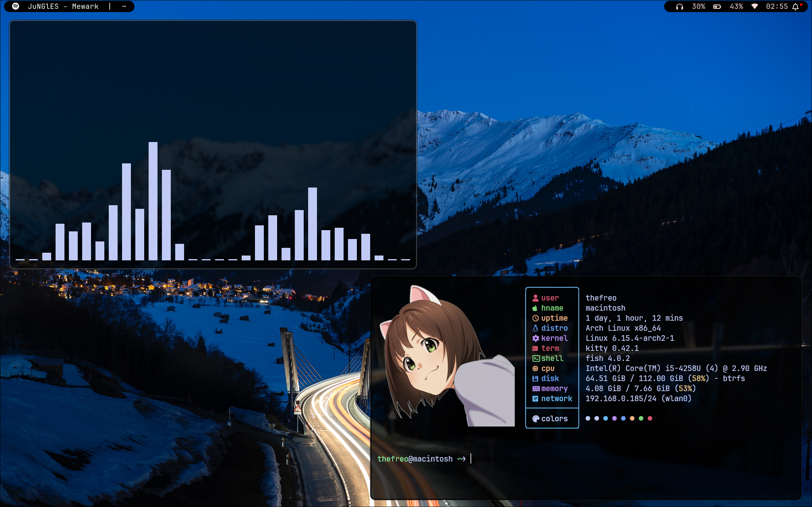
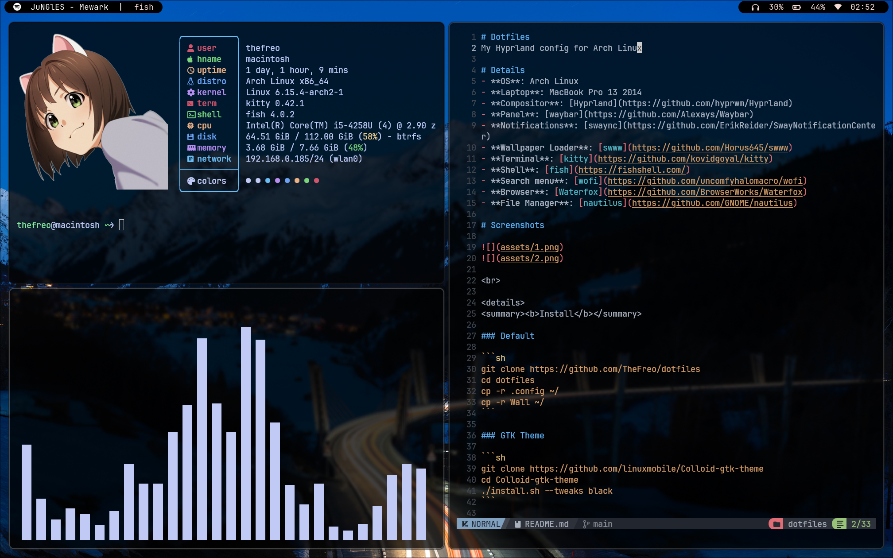

# Dotfiles
My Hyprland config for Arch Linux

## Details
- **OS**: Arch Linux
- **Laptop**: MacBook Pro 13 2014
- **Compositor**: [Hyprland](https://github.com/hyprwm/Hyprland)
- **Panel**: [waybar](https://github.com/Alexays/Waybar)
- **Notifications**: [swaync](https://github.com/ErikReider/SwayNotificationCenter)
- **Wallpaper Loader**: [swww](https://github.com/Horus645/swww)
- **Terminal**: [kitty](https://github.com/kovidgoyal/kitty)
- **Shell**: [fish](https://fishshell.com/)
- **Search menu**: [wofi](https://github.com/uncomfyhalomacro/wofi)
- **Browser**: [Waterfox](https://github.com/BrowserWorks/Waterfox)
- **File Manager**: [nautilus](https://github.com/GNOME/nautilus)

## Screenshots




<br>

<details>
<summary><b>Install</b></summary>

### Default

```sh
git clone https://github.com/TheFreo/dotfiles
cd dotfiles
cp -r .config ~/
cp -r Wall ~/
swww img ~/Wall/6.jpg
```

### Fonts

```sh
ttf-font-awesome
otf-font-awesome
ttf-jetbrains-mono
ttf-ubuntu-mono-nerd
ttf-dejavu
powerline-fonts
adobe-source-han-sans-jp-fonts
```

### GTK Theme

```sh
git clone https://github.com/linuxmobile/Colloid-gtk-theme
cd Colloid-gtk-theme
./install.sh --tweaks black
```

### GTK Icons

```sh
git clone https://github.com/vinceliuice/WhiteSur-icon-theme
cd WhiteSur-icon-theme
./install.sh
```

</details>

<details>
<summary><b>Other</b></summary>

### Packages for MacBook

```sh
brightnessctl
broadcom-wl
macfan-git
libinput-gestures
playerctl
tlp
```

</details>
